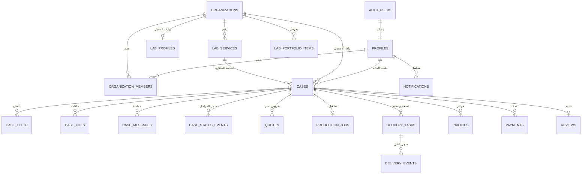
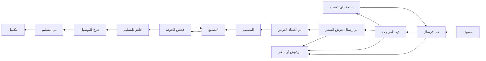

# هندسة قاعدة بيانات وصلة

هذه قاعدة مشتركة لمنتجين مستقلين في الواجهة، لكنهما يعملان على نفس دورة الحالة:

- بوابة المعمل على الويب لاستقبال الطلبات والتسعير والإنتاج والتوصيل.
- تطبيق الطبيب على Expo لإنشاء الطلبات ورفع الملفات واعتماد العرض ومتابعة الحالة.

التنفيذ مبني على PostgreSQL ومتوافق مع Supabase Auth وStorage وRealtime. القاعدة لا تعتمد على كود واجهة المعمل الحالي، لذلك يمكن ربط تطبيق الطبيب الجديد بها من دون نسخ البيانات أو إنشاء قاعدة ثانية.

## قرارات النطاق

- `cases` هي الوحدة المركزية، وتمثل طلب تصنيع واحدًا بين عيادة ومعمل.
- المستخدم قد يعمل في أكثر من عيادة أو معمل؛ لذلك الصلاحية موجودة في `organization_members` وليست حقلًا عامًا داخل `profiles`.
- لا نخزن اسم المريض الكامل في الـMVP. نخزن `patient_reference` كرمز داخلي للعيادة وعمرًا اختياريًا فقط.
- الأسعار والمدفوعات تحفظ بالهللات داخل حقول `*_minor` من نوع `bigint`. مثال: `85000` يعني `850.00 SAR`.
- ملفات المسح والأشعة والصور السريرية تحفظ في Storage خاص، بينما الجدول `case_files` يحتفظ بالوصف والمسار فقط.
- أي تغيير في مرحلة الحالة يمر عبر دوال مضبوطة، ويسجل في `case_status_events` لبناء Timeline موثوق.
- عمليات الدفع لا تكتب من تطبيق الجوال أو المتصفح مباشرة. المزود أو webhook موثوق هو من يكتب في `payments` لاحقًا.

## مخطط العلاقات



## دورة الحالة



الحالتان `quote_sent` و`quote_accepted` لا تتغيران بتحديث مباشر. المعمل يستدعي `send_quote` والطبيب يستدعي `accept_quote` حتى يتغير عرض السعر والحالة ويسجل الحدث داخل معاملة واحدة.

## نموذج الصلاحيات

| العملية | الطبيب/العيادة | المعمل | الخادم الموثوق |
|---|---:|---:|---:|
| استعراض دليل المعامل | نعم | نعم | نعم |
| إنشاء حالة وتعديل المسودة | نعم | لا | نعم |
| مشاهدة الحالة والملفات المشتركة | للحالات التابعة | للحالات التابعة | نعم |
| إرسال عرض سعر | لا | مدير/منسق/مالية | نعم |
| اعتماد عرض السعر | الطبيب/مدير العيادة | لا | نعم |
| تحديث الإنتاج والتوصيل | لا | حسب دور الموظف | نعم |
| كتابة دفعة ناجحة | لا | لا | نعم، من webhook |
| إضافة تقييم | طبيب الحالة بعد التسليم | قراءة | نعم |

كل جدول في `public` عليه RLS، والمنح للـData API صريحة. المفتاح المنشور فقط هو المناسب للويب والجوال، ولا يوضع `service_role` أو أي مفتاح سري داخل أي تطبيق عميل.

## التخزين

### `case-files` — خاص

المسار الإلزامي:

```text
<case_id>/<file_id>/<safe-file-name>
```

يستطيع طرفا الحالة القراءة. يستطيع صاحب الملف أو مدير/منسق المعمل تحديثه أو حذفه. الحد الأعلى `100 MiB`، والأنواع المسموحة تشمل الصور وPDF وDICOM وSTL وZIP.

### `public-assets` — عام للقراءة

المسارات:

```text
avatars/<user_id>/<file-name>
labs/<laboratory_id>/<file-name>
```

هذا الـbucket مخصص للصورة الشخصية وشعار المعمل ومعرض الأعمال فقط، ولا توضع داخله صور المرضى أو ملفات الحالات.

## Realtime

الاشتراك مفعل فقط للجداول التي يحتاجها المنتج لحظيًا:

- `cases`
- `case_messages`
- `case_status_events`
- `quotes`
- `production_jobs`
- `delivery_tasks`
- `notifications`

RLS يبقى مطبقًا عند الاستماع، لذلك الطبيب لا يستقبل أحداث حالات عيادة أخرى.

## الملفات

- `supabase/migrations/202608210001_core_schema.sql`: الأنواع والجداول والعلاقات والفهارس والتحقق الأساسي.
- `supabase/migrations/202608210002_access_control.sql`: المنح وRLS ودوال إنشاء الجهة وانتقال الحالة وإرسال/اعتماد العرض.
- `supabase/migrations/202608210003_storage_realtime.sql`: Buckets وسياسات Storage وقائمة Realtime.
- `supabase/seed.sql`: خمسة معامل وخدمات تجريبية من دون مستخدمين أو بيانات مرضى.

## التشغيل المحلي لاحقًا

يتطلب التشغيل الكامل Docker Desktop وSupabase CLI:

```bash
npx supabase start
npx supabase db reset
```

وبعد ربط مشروع Supabase حقيقي، تطبق migrations من بيئة تطوير أولًا، ثم تجرى اختبارات RLS بحساب طبيب وحساب معمل قبل اعتمادها على الإنتاج.

## ربط الواجهتين

كل واجهة تملك طبقة `services` و`types` خاصة بها، لكن تستخدم نفس Project URL والمفتاح المنشور:

```text
Lab Web       -> Supabase Auth / Data API / Storage / Realtime
Doctor Expo   -> Supabase Auth / Data API / Storage / Realtime
                         |
                         v
                 PostgreSQL + RLS
```

في المرحلة التالية يولد ملف TypeScript من المخطط لكل مشروع، ثم نستبدل بيانات الـMock تدريجيًا: دليل المعامل أولًا، وبعده إنشاء الحالة، ثم المحادثة والتتبع.

